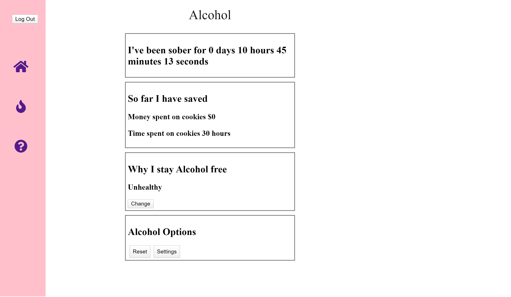

# Addiction
Addiction is a platform to help users break bad habits by providing assessment of their habits and ongoing support along their journey.

Site Is Built From Scratch.

***

## Site is Live At:

**Project Start Date:** 13/01/2020

**The Problem:** Everyone has some sort of bad habit which we are trying to break from. Whether is being addicted to some drinks like Alcohol or Coffee, or other chemicals like sugar or salt. Sometimes these bad habits are difficult to break because we lose track of time, of our progress and staying focused and motivated.

**The Solution:** Addiction provides a platform for users to log when was the last time they were addicted free and keep oneself motivated as time goes by. Users will be able to select their addiction from a list or create one themselves. Add the starting day of being sober and the motive of why they want to break that habit. They will also be able to see how much money and time they saved from the first sober date. From a pool of motivations, one will be rendered randomly in case they need words of wisdom to keep motivated and focused.

**What This Project Is For Me**
1) Challenge: this is my very first React website so there are many aspects which I had to Google up and do research about to understand and overcome any small challenges when building this platform. So I had to self-teach myself a new JavaScript framework in order to prove myself that I could learn and put an initial idea together even without prior experience.

### Day 1: Landing Page for Register form

### Day 6: Initial draft for displaying and adding all addictions of a user

### Day 12: Draft of specific Addiction with functioning clock counter and data stored from user displayed

## Built with
* CSS - Styling
* npm - Package Manager
* React.js - JavaScript framework used
* VSCode - Text Editor

## Credits
* Flaticon - Icon assets
* FontAwesome - Icon assets

